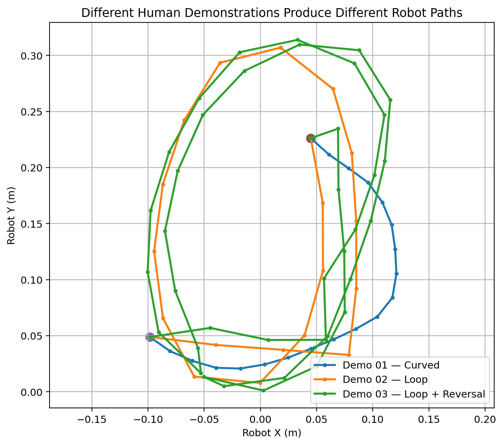

# HumanTrace: Lightweight Human-to-Robot Trajectory Retargeting

HumanTrace is a lightweight pipeline for transferring the **geometric structure of personally collected human manipulation demonstrations** to a Panda robot in LIBERO.

The project asks a simple question:

> Can a small amount of personally collected human motion data directly shape robot behaviour without training a large imitation-learning policy?

In this prototype, the answer is yes.

Short smartphone demonstrations are manually annotated to recover object trajectories. The trajectories are smoothed, normalized, resampled, and geometrically retargeted to the robot workspace.

The robot then performs a complete manipulation sequence:

**grasp → lift → human-derived transport → place → release**

while preserving the demonstrated transport geometry.

---

## Demo


The main HumanTrace run successfully completes the LIBERO task:

> **Pick up the black bowl from the table centre and place it on the plate.**

### Key Results

- Complete LIBERO pick-and-place: **success**
- Human-derived maximum lateral deviation from straight line: **146 mm**
- Mean robot tracking error: **7.3 mm**
- Final bowl-to-plate XY error: **5.4 mm**
- LIBERO reward: **1.0**
- Three personally collected motion demonstrations tested

---

## Core Idea

HumanTrace separates manipulation into two components:

```text
Robot-specific interaction
        +
Human-derived transport geometry
```

The Panda-specific primitive handles embodiment-dependent grasp and lift behaviour.

The personally collected human demonstration determines the geometry of the post-grasp transport path.

Placement and release are then handled by a simple robot-specific controller.

This separation is intentional.

Grasping depends strongly on gripper geometry, end-effector orientation, contact dynamics, timing, and robot embodiment. In contrast, the geometric structure of a demonstrated transport motion can be transferred between embodiments.

---

## What Is Actually Driven by My Data?

The personally collected human demonstrations are not used only for visualisation or offline analysis.

They directly determine the robot's transport trajectory after grasping.

In the controlled comparison:

- the robot initial state is fixed,
- the grasp primitive is fixed,
- the controller is fixed,
- the target object is fixed,
- the destination is fixed,
- the placement procedure is fixed,
- the release procedure is fixed.

The changed component is the transport trajectory.

For HumanTrace, the trajectory is generated from personally collected human motion.

For the baseline, the trajectory is replaced by a straight-line interpolation.

This makes the effect of the collected human data directly observable and measurable.

---

## Why This Approach?

I deliberately chose a lightweight geometric retargeting pipeline rather than immediately training a large policy.

The goal was to make the dependency between collected human data and robot behaviour explicit and easy to verify.

The pipeline provides a clear causal chain:

```text
human motion geometry
        ↓
retargeted robot waypoints
        ↓
robot transport behaviour
```

This also makes controlled comparisons straightforward.

The main trade-off is that grasping remains robot-specific rather than being learned from the human demonstration.

---

## Pipeline

```text
Personally collected smartphone video
                ↓
Manual object-centre annotation
                ↓
Savitzky-Golay smoothing
                ↓
Relative trajectory representation
                ↓
Trajectory normalization
                ↓
Arc-length resampling
                ↓
Compact waypoint trajectory
                ↓
2D similarity transform
(rotation + scale + translation)
                ↓
Panda transport trajectory
                ↓
Complete LIBERO pick-and-place
```

The main experiment uses 20 transport waypoints.

For the more geometrically complex Demo 03, 40 waypoints are used to preserve direction-reversal structure while reducing the distance between consecutive robot targets.

---

## 1. Personally Collected Human Demonstrations

All three source demonstrations were personally recorded using a smartphone.

They deliberately contain increasingly complex transport geometry:

- **Demo 01:** curved transport
- **Demo 02:** large loop
- **Demo 03:** loop with direction reversal

The raw videos are not included in the public repository in order to keep the submission lightweight. They are excluded through `.gitignore`.

All processed trajectory data derived from the recordings is included under:

```text
data/processed/
```

Demo 01 contains 57 manually labelled object-centre observations.

Demo 02 contains 117 labelled observations.

Demo 03 contains 209 labelled observations.

The relevant transport phases are isolated and processed into compact robot-transfer representations.

---

## 2. Human Trajectory Processing

The manually labelled image-space trajectories contain small annotation noise and non-uniform temporal spacing.

A Savitzky-Golay filter is applied to reduce annotation noise while preserving the overall demonstrated motion structure.

### Demo 01: Raw trajectory and smoothing


Each trajectory is then:

- converted to relative displacement,
- vertically flipped to match a Cartesian-style convention,
- normalized while preserving geometric shape,
- resampled by arc length.

### Demo 01: Normalized trajectory


Arc-length resampling provides approximately even spatial spacing between waypoints rather than simply sampling at equal time intervals.

Demo 01 and Demo 02 use 20 waypoints.

Demo 03 uses 40 waypoints because its longer loop-and-reversal trajectory contains substantially more geometric structure.

---

## 3. Human-to-Robot Retargeting

Let the processed human trajectory be:

```text
p_h(t)
```

The robot transport trajectory is generated using a 2D similarity transform:

```text
p_r(t) = p_start + s R p_h(t)
```

where:

- `R` rotates the human start-to-end direction toward the robot bowl-to-plate direction,
- `s` scales the demonstrated endpoint displacement to the robot task distance,
- `p_start` translates the transformed trajectory to the robot's transport start position.

This preserves the **shape and ordering of the human motion** while adapting it to the robot workspace.

For the main Demo 01 run:

```text
Human trajectory endpoint:
[-0.8452, 0.4393]

Robot bowl → plate vector:
[0.1432, 0.1773]

Rotation:
-101.46 degrees

Scale:
0.2393
```

The transformed endpoint matches the required planar bowl-to-plate displacement while the intermediate waypoints retain the non-linear demonstrated path.

---

## 4. Robot-Specific Grasp Primitive

Stable grasping proved substantially more embodiment-dependent than trajectory following.

An initial position-only approach was tested using a brute-force search across **48 candidate grasp positions** around the bowl rim.

None produced a reliable lift.

This showed that grasp success depends on more than Cartesian position alone, including:

- end-effector orientation,
- contact geometry,
- gripper timing,
- interaction dynamics,
- robot embodiment.

To keep the project focused on human-to-robot trajectory transfer rather than grasp planning, the final system uses a compact Panda-specific grasp-and-lift primitive extracted from a successful LIBERO demonstration.

Only the information required for the primitive is retained:

```text
one simulator initial state
+
56 grasp-and-lift actions
```

The resulting file is:

```text
data/robot_primitives/panda_grasp_demo0.npz
```

and is only a few kilobytes in size.

Importantly:

> **The LIBERO primitive is used only for embodiment-specific grasp and lift behaviour. The transport path after grasping is generated from the personally collected human demonstration.**

No official LIBERO transport actions are used by HumanTrace.

The full official LIBERO demonstration dataset is not required by the final repository.

---

## 5. Complete HumanTrace Pick-and-Place

The main HumanTrace execution follows:

```text
Initial task state
        ↓
Panda grasp primitive
        ↓
Stable bowl lift
        ↓
Human trajectory retargeting
        ↓
Human-derived transport
        ↓
Align bowl above plate
        ↓
Descend
        ↓
Open gripper
        ↓
Retract
        ↓
Task success
```

The main Demo 01 run achieved:

```text
Final bowl-to-plate XY error: 0.0054 m
LIBERO reward:               1.0
Environment done:            True
```

Example result files are stored in:

```text
results/final_pick_place/
```

This directory corresponds to the main HumanTrace experiment.

---

## 6. Straight-Line Baseline

A controlled straight-line baseline is included to verify that the human demonstration actually changes robot behaviour.

The HumanTrace Demo 01 experiment and straight-line baseline use the same:

- initial simulator state,
- Panda grasp primitive,
- controller,
- number of transport waypoints,
- transport start,
- destination,
- placement procedure,
- release procedure.

The only experimental difference is the transport geometry.

```text
HumanTrace:
human-derived curved trajectory

Straight-line baseline:
linear interpolation from start to goal
```

The result directories are:

```text
results/final_pick_place/
```

for the main HumanTrace experiment, and:

```text
results/final_pick_place_straight/
```

for the straight-line baseline.

Both are complete pick-and-place runs under the same experimental conditions.

---

## 7. HumanTrace vs Straight-Line Baseline


| Metric | HumanTrace | Straight Line |
|---|---:|---:|
| Transport waypoints | 20 | 20 |
| Target path length | **0.414 m** | **0.228 m** |
| Maximum lateral deviation | **0.146 m** | **~0 m** |
| Mean tracking error | **7.3 mm** | **7.4 mm** |
| Final placement error | **5.4 mm** | **5.5 mm** |
| Task success | **Yes** | **Yes** |

The straight-line baseline is naturally shorter.

HumanTrace is **not** intended to outperform a straight line in path length.

The experiment instead asks whether the non-linear structure of human motion can be preserved while maintaining successful manipulation.

The HumanTrace path exhibits:

```text
Maximum lateral deviation:

HumanTrace:    146 mm
Straight line: ~0 mm
```

while maintaining almost identical tracking performance:

```text
Mean tracking error:

HumanTrace:    7.3 mm
Straight line: 7.4 mm
```

and nearly identical final placement accuracy:

```text
HumanTrace:    5.4 mm
Straight line: 5.5 mm
```

Both methods complete the task successfully.

---

## 8. Additional Human Demonstrations

To test whether HumanTrace was tied to a single trajectory, I collected two additional human demonstrations with increasingly complex motion geometry.

- **Demo 01:** curved transport
- **Demo 02:** large loop
- **Demo 03:** loop with direction reversal

All three demonstrations generated distinct robot transport paths and all three completed the same LIBERO pick-and-place task successfully.



| Demonstration | Motion structure | Waypoints | Target path length | Mean tracking error | Max tracking error | Final placement error | Task success |
|---|---|---:|---:|---:|---:|---:|---:|
| Demo 01 | Curved | 20 | 0.414 m | 7.3 mm | 7.9 mm | 5.4 mm | Yes |
| Demo 02 | Loop | 20 | 1.129 m | 7.3 mm | 8.0 mm | 5.5 mm | Yes |
| Demo 03 | Loop + reversal | 40 | 2.010 m | 8.7 mm | 25.5 mm | 6.4 mm | Yes |

The corresponding measured bowl path lengths were:

```text
Demo 01: 0.388 m
Demo 02: 1.073 m
Demo 03: 1.899 m
```

These experiments show that HumanTrace is not simply replaying one fixed robot path.

Different personally collected human demonstrations produce qualitatively different robot transport behaviours while still allowing the same manipulation task to complete successfully.

The more complex Demo 03 required a denser 40-waypoint representation. This reduced its maximum consecutive robot target spacing from approximately 11 cm with 20 waypoints to approximately 5.5 cm with 40 waypoints, preserving the reversal structure more faithfully.

---

## Observed Limitation: No Obstacle Awareness

The additional demonstrations also revealed an important limitation.

The more aggressive loop trajectories in Demo 02 and Demo 03 caused incidental contact with nearby scene objects, even though the target pick-and-place task still completed successfully.

This behaviour is consistent with the current design of HumanTrace.

The retargeting algorithm preserves demonstrated geometry using a similarity transform, but it currently does **not** reason about:

- obstacle locations,
- scene geometry,
- collision constraints,
- safe object clearance.

The current pipeline is therefore:

```text
human trajectory
        ↓
geometric retargeting
        ↓
robot trajectory
```

without a scene-aware collision-checking stage.

A human-derived trajectory can therefore be geometrically valid but not collision-free after being transferred into a different robot scene.

This is particularly visible in the longer loop and reversal demonstrations.

---

## How I Would Address This

Several extensions could make HumanTrace scene-aware while preserving the structure of the human demonstration.

### 1. Collision Checking

Before execution, transformed waypoints could be checked against known simulator object geometry.

Unsafe trajectory segments could therefore be detected before robot motion begins.

### 2. Constrained Trajectory Optimisation

The human-derived trajectory could be treated as a reference path rather than an immutable path.

An optimisation objective could minimise deviation from the demonstrated trajectory while enforcing:

```text
collision avoidance
+
robot workspace limits
+
trajectory smoothness
```

Conceptually:

```text
minimise:
deviation from human-derived motion

subject to:
collision constraints
workspace constraints
smoothness constraints
```

### 3. Local Path Deformation

Instead of replacing the full human trajectory, only unsafe sections could be locally displaced around obstacles.

This would preserve as much of the demonstrated motion structure as possible.

### 4. 3D Retargeting

HumanTrace currently performs planar XY retargeting.

Adding a vertical component would allow the robot to lift the transported object over obstacles while retaining the overall planar structure of the demonstration.

### 5. Scene-Conditioned Learning

With a larger dataset, a learned trajectory model or policy could condition jointly on:

```text
human motion
+
robot embodiment
+
scene geometry
```

and learn when a demonstrated trajectory should be modified for safe execution.

---

## Main Result

The purpose of HumanTrace is not to generate the shortest possible trajectory.

The main result is:

> **Personally collected human manipulation demonstrations can directly and measurably alter the geometry of robot behaviour while preserving successful task execution.**

The three demonstrations progressively increase motion complexity:

```text
curved path
    ↓
loop
    ↓
loop + reversal
```

and produce correspondingly different robot transport trajectories.

The additional experiments also expose a clear next research problem: preserving human motion intent while satisfying scene-specific collision constraints.

---

## Repository Structure

```text
HumanTrace/
│
├── README.md
├── .gitignore
│
├── data/
│   ├── processed/
│   │   ├── demo01_points.csv
│   │   ├── demo01_clean.csv
│   │   ├── demo01_waypoints.csv
│   │   ├── demo02_points.csv
│   │   ├── demo02_clean.csv
│   │   ├── demo02_waypoints.csv
│   │   ├── demo03_points.csv
│   │   ├── demo03_clean.csv
│   │   └── demo03_waypoints.csv
│   │
│   └── robot_primitives/
│       └── panda_grasp_demo0.npz
│
├── scripts/
│   ├── label_trajectory.py
│   ├── label_trajectory_demo02.py
│   ├── label_trajectory_demo03.py
│   ├── process_trajectory.py
│   ├── process_trajectory_demo02.py
│   ├── process_trajectory_demo03.py
│   ├── run_human_trajectory.py
│   ├── run_straight_baseline.py
│   ├── run_pick_place.py
│   ├── run_pick_place_demo02.py
│   ├── run_pick_place_demo03.py
│   ├── run_pick_place_straight.py
│   ├── analyze_results.py
│   └── make_demo_gif.py
│
└── results/
    ├── comparison_metrics.csv
    ├── multi_demo_metrics.csv
    ├── human_trajectory_raw_vs_smooth.png
    ├── human_trajectory_normalized.png
    ├── humantrace_vs_straight.png
    ├── multi_demo_robot_paths.png
    ├── humantrace_pick_place.gif
    │
    ├── final_pick_place/
    │   ├── 01_after_grasp.png
    │   ├── transport_10.png
    │   ├── 23_final.png
    │   └── transport_log.csv
    │
    ├── final_pick_place_straight/
    │   ├── transport_19.png
    │   ├── 23_final.png
    │   └── transport_log.csv
    │
    ├── final_pick_place_demo02/
    │   ├── transport_10.png
    │   ├── 23_final.png
    │   └── transport_log.csv
    │
    └── final_pick_place_demo03/
        ├── transport_20.png
        ├── 23_final.png
        └── transport_log.csv
```

---

## Running the Project

The project was developed using:

```text
Python 3.8
LIBERO
robosuite 1.4.0
MuJoCo
NumPy
Pandas
SciPy
OpenCV
Matplotlib
imageio
```

## What Worked

- Personally collected human trajectories directly produced different robot behaviours.
- Manual trajectory annotation was sufficient for a lightweight prototype.
- Savitzky-Golay smoothing reduced annotation noise while preserving motion structure.
- Arc-length resampling provided stable spatial waypoint spacing.
- The 2D similarity transform transferred curved, loop, and reversal trajectories.
- The Panda maintained the grasp through transport paths up to approximately 2.0 m long.
- All three human-derived demonstrations completed the target LIBERO manipulation task.
- The straight-line controlled baseline confirmed that the demonstrated geometry was responsible for the altered robot motion.

---

## What Did Not Work

### Position-only grasping

A purely position-based grasp strategy was not sufficient.

Even after testing 48 candidate Cartesian grasp positions around the bowl rim, the robot did not achieve a reliable lift.

This motivated the separation between:

```text
embodiment-specific interaction
```

and:

```text
transferable motion geometry
```

### Collision-free transfer

The more complex human-derived paths were successfully transferred, but Demo 02 and Demo 03 caused incidental contact with nearby objects.

This exposed the lack of scene-aware collision reasoning in the current geometric retargeting method.

Both failures therefore informed the final system design and its future directions.

---

## Limitations

The current prototype uses:

- three personally collected demonstrations,
- manual rather than automatic trajectory extraction,
- planar 2D retargeting,
- one LIBERO manipulation task,
- one Panda-specific grasp primitive,
- no learned grasp policy,
- no depth reconstruction from smartphone video,
- no scene-aware collision avoidance.

The results demonstrate feasibility and trajectory-conditioned robot behaviour rather than broad task or embodiment generalisation.

---

## Future Work

Natural extensions include:

- automatic RGB object tracking,
- larger sets of human demonstrations,
- 3D trajectory reconstruction,
- scene-aware collision checking,
- constrained trajectory optimisation,
- obstacle-aware local path deformation,
- evaluation across multiple LIBERO tasks,
- learned grasp primitives,
- adaptation across different robot embodiments,
- learned scene-conditioned trajectory models.
