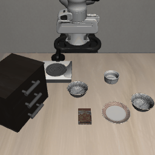

# HumanTrace: Lightweight Human-to-Robot Trajectory Retargeting

HumanTrace is a lightweight pipeline for transferring the geometric structure of a personally collected human manipulation demonstration to a robot manipulation task in LIBERO.

The goal is not to train a large policy. Instead, the project asks a simpler question:

> Can a small amount of personally collected human motion data directly shape robot behaviour while still completing a manipulation task successfully?

The answer in this prototype is yes.

A short phone video is manually annotated to recover an object trajectory. The trajectory is smoothed, normalized, resampled, and then retargeted to a Panda robot using a 2D similarity transform. A robot-specific grasp and placement primitive handles embodiment-dependent interaction, while the human demonstration controls the transport geometry.

---

## Demo



The robot:

1. grasps the bowl,
2. lifts it,
3. follows a transport path derived from the human demonstration,
4. aligns above the plate,
5. releases the bowl,
6. retracts.

The final LIBERO task completes successfully.

---

## Pipeline

```text
Personally collected phone video
        ↓
Manual object-centre annotation
        ↓
Savitzky-Golay smoothing
        ↓
Relative trajectory representation
        ↓
Normalization
        ↓
Arc-length resampling
        ↓
20 human waypoints
        ↓
2D similarity transform
(rotation + scale + translation)
        ↓
Panda transport trajectory
        ↓
Complete LIBERO pick-and-place
