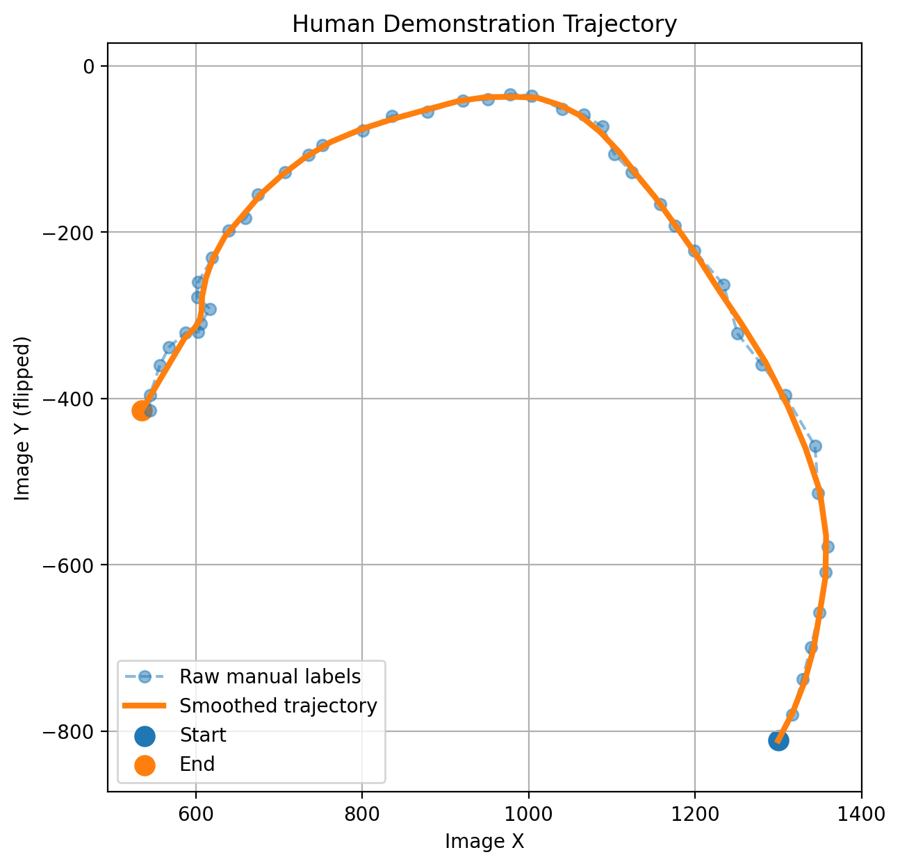
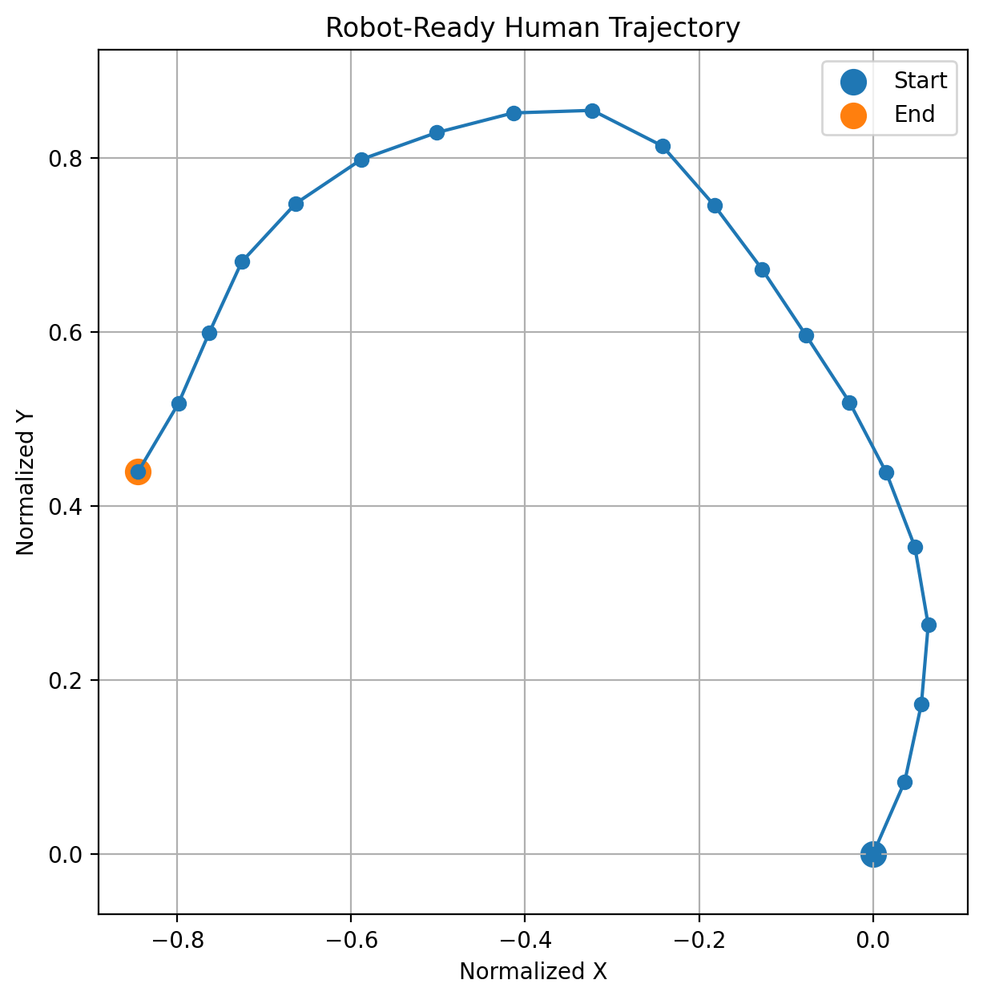
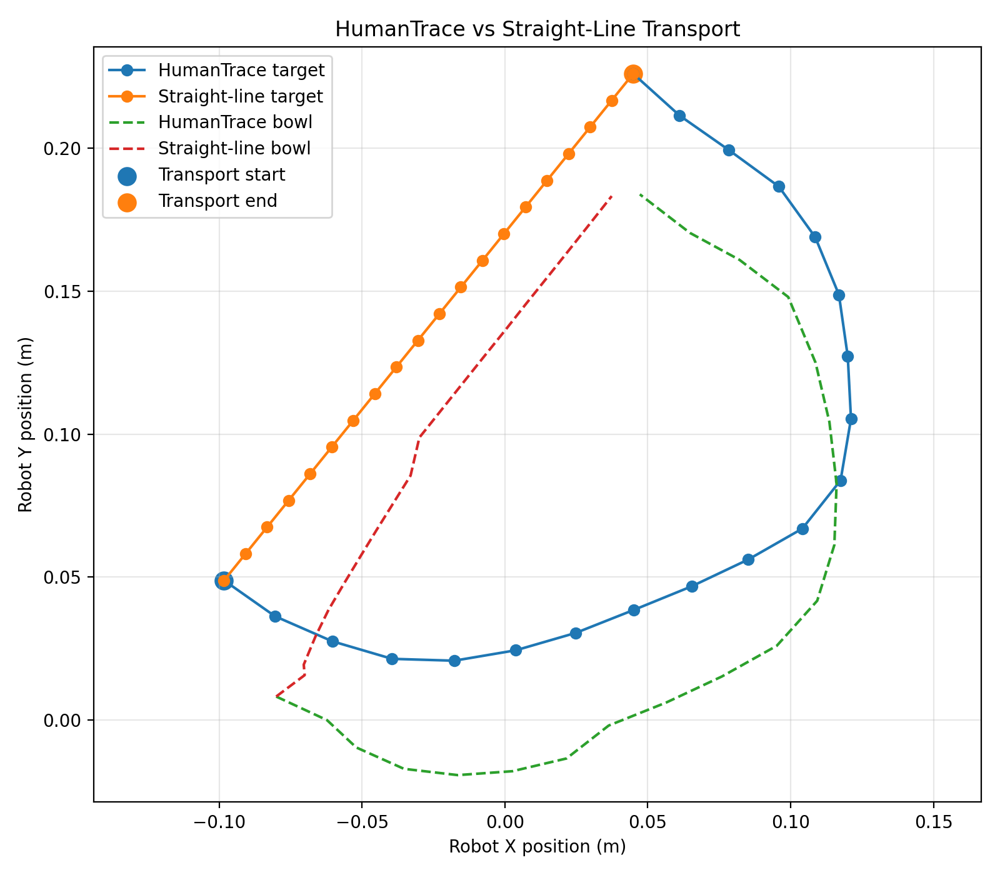

# HumanTrace: Lightweight Human-to-Robot Trajectory Retargeting

HumanTrace is a lightweight pipeline for transferring the **geometric structure of a personally collected human manipulation demonstration** to a Panda robot in LIBERO.

The project asks a simple question:

> Can a small amount of personally collected human motion data directly shape robot behaviour without training a large imitation-learning policy?

In this prototype, the answer is yes.

A short smartphone demonstration is manually annotated to recover the manipulated object's trajectory. The trajectory is then smoothed, normalized, resampled, and geometrically retargeted to the robot workspace.

The robot performs a complete manipulation sequence:

**grasp → lift → human-derived transport → place → release**

while preserving the curved transport geometry of the human demonstration.

---

## Demo


The final HumanTrace run successfully completes the LIBERO task:

> **Pick up the black bowl from the table centre and place it on the plate.**

### Key Results

- Complete LIBERO pick-and-place: **success**
- Human-derived maximum lateral deviation from straight line: **146 mm**
- Mean robot tracking error: **7.3 mm**
- Final bowl-to-plate XY error: **5.4 mm**
- LIBERO reward: **1.0**

---

## Core Idea

HumanTrace separates manipulation into two components:

```text
Robot-specific interaction
        +
Human-derived transport geometry
```

The Panda-specific primitive handles embodiment-dependent grasp and lift behaviour.

The personally collected human demonstration determines the geometry of the post-grasp transport path.

Placement and release are then handled by a simple robot-specific controller.

This separation is intentional.

Grasping depends strongly on gripper geometry, end-effector orientation, contact dynamics, timing, and robot embodiment. In contrast, the geometric structure of a demonstrated transport motion can be transferred between embodiments.

---

## What Is Actually Driven by My Data?

The personally collected human demonstration is not used only for visualisation or offline analysis.

It directly determines the robot's transport trajectory after grasping.

In the final controlled experiment:

- the robot initial state is fixed,
- the grasp primitive is fixed,
- the controller is fixed,
- the number of transport waypoints is fixed,
- the placement procedure is fixed,
- the target object is fixed,
- the destination is fixed.

The only changed component is the transport trajectory.

For HumanTrace, this trajectory is generated from my personally collected human demonstration.

For the baseline, it is replaced by a straight-line interpolation.

This makes the effect of the collected human data directly observable and measurable.

---

## Why This Approach?

I deliberately chose a lightweight geometric retargeting pipeline rather than immediately training a large policy.

The challenge requires personally collected data to have a meaningful effect on robot behaviour, so I wanted that dependency to be explicit and easy to verify.

The pipeline provides a clear causal chain:

```text
human motion geometry
        ↓
retargeted robot waypoints
        ↓
robot transport behaviour
```

This also makes it possible to build a controlled straight-line baseline and directly measure the effect of the human demonstration.

The main trade-off is that grasping remains robot-specific rather than being learned from the human demonstration.

---

## Pipeline

```text
Personally collected smartphone video
                ↓
Manual object-centre annotation
                ↓
Savitzky-Golay smoothing
                ↓
Relative trajectory representation
                ↓
Trajectory normalization
                ↓
Arc-length resampling
                ↓
20 human waypoints
                ↓
2D similarity transform
(rotation + scale + translation)
                ↓
Panda transport trajectory
                ↓
Complete LIBERO pick-and-place
```

---

## 1. Personally Collected Human Demonstration

The source manipulation demonstration was personally recorded using a smartphone.

The demonstrator moves an object along a deliberately curved path rather than taking the shortest direct route from start to goal.

The raw video is not included in the public repository in order to keep the submission lightweight. It is excluded through `.gitignore`.

All processed trajectory data derived from the recording is included under:

```text
data/processed/
```

The demonstration was manually annotated, producing **57 labelled object-centre observations**.

The transport phase was then isolated and processed into a compact robot-transfer representation.

---

## 2. Human Trajectory Processing

The manually labelled image-space trajectory contains small annotation noise and non-uniform temporal spacing.

A Savitzky-Golay filter is applied to reduce annotation noise while preserving the overall demonstrated motion shape.

### Raw trajectory and smoothing



The trajectory is then:

- converted to relative displacement,
- vertically flipped to match a Cartesian-style convention,
- normalized while preserving geometric shape,
- resampled by arc length.

### Normalized trajectory



The final representation contains **20 approximately equally spaced waypoints**.

This produces a compact motion representation that can be transferred to a robot with a different workspace size and orientation.

---

## 3. Human-to-Robot Retargeting

Let the processed human trajectory be:

```text
p_h(t)
```

The robot transport trajectory is generated using a 2D similarity transform:

```text
p_r(t) = p_start + s R p_h(t)
```

where:

- `R` rotates the human start-to-end direction toward the robot bowl-to-plate direction,
- `s` scales the demonstrated displacement to the robot task distance,
- `p_start` translates the transformed trajectory to the robot's transport start position.

This preserves the **shape of the human motion** while adapting it to the robot workspace.

For the final successful HumanTrace run:

```text
Human trajectory endpoint:
[-0.8452, 0.4393]

Robot bowl → plate vector:
[0.1432, 0.1773]

Rotation:
-101.46 degrees

Scale:
0.2393
```

The transformed trajectory therefore ends at the correct planar task displacement while retaining the non-linear structure of the human demonstration.

---

## 4. Robot-Specific Grasp Primitive

Stable grasping proved substantially more embodiment-dependent than trajectory following.

An initial position-only approach was tested using a brute-force search across **48 candidate grasp positions** around the bowl rim.

None produced a reliable lift.

This showed that grasp success depends on more than Cartesian position alone, including:

- end-effector orientation,
- contact geometry,
- gripper timing,
- interaction dynamics,
- robot embodiment.

To keep the project focused on human-to-robot trajectory transfer rather than grasp planning, the final system uses a compact Panda-specific grasp-and-lift primitive extracted from a successful LIBERO demonstration.

Only the information required for the primitive is retained:

```text
one simulator initial state
+
56 grasp-and-lift actions
```

The resulting file is:

```text
data/robot_primitives/panda_grasp_demo0.npz
```

and is only a few kilobytes in size.

Importantly:

> **The LIBERO primitive is used only for embodiment-specific grasp and lift behaviour. The transport path after grasping is generated from the personally collected human demonstration.**

The full official LIBERO demonstration dataset is not required by the final repository.

---

## 5. Complete HumanTrace Pick-and-Place

The final HumanTrace execution follows:

```text
Initial task state
        ↓
Panda grasp primitive
        ↓
Stable bowl lift
        ↓
Human trajectory retargeting
        ↓
20-waypoint curved transport
        ↓
Align bowl above plate
        ↓
Descend
        ↓
Open gripper
        ↓
Retract
        ↓
Task success
```

The final HumanTrace run achieved:

```text
Final bowl-to-plate XY error: 0.0054 m
LIBERO reward:               1.0
Environment done:            True
```

Example result files are stored in:

```text
results/final_pick_place/
```

This directory corresponds to the **HumanTrace human-derived transport experiment**.

---

## 6. Straight-Line Baseline

A controlled straight-line baseline is included to verify that the human demonstration actually changes robot behaviour.

Both experiments use exactly the same:

- initial simulator state,
- Panda grasp primitive,
- controller,
- number of transport waypoints,
- start location,
- destination,
- placement procedure,
- release procedure.

The only difference is transport geometry.

```text
HumanTrace:
human-derived curved trajectory

Straight-line baseline:
linear interpolation from start to goal
```

The result folders correspond to the two experiments:

```text
results/final_pick_place/
```

contains the **HumanTrace experiment**.

```text
results/final_pick_place_straight/
```

contains the **straight-line baseline**.

Both are complete pick-and-place runs under the same experimental conditions.

---

## 7. Quantitative Comparison



| Metric | HumanTrace | Straight Line |
|---|---:|---:|
| Transport waypoints | 20 | 20 |
| Target path length | **0.414 m** | **0.228 m** |
| Maximum lateral deviation | **0.146 m** | **~0 m** |
| Mean tracking error | **7.3 mm** | **7.4 mm** |
| Final placement error | **5.4 mm** | **5.5 mm** |
| Task success | **Yes** | **Yes** |

The straight-line baseline is naturally shorter.

HumanTrace is **not** intended to outperform a straight line in path length.

The experiment instead asks whether the non-linear structure of human motion can be preserved while maintaining successful manipulation.

The answer is yes.

The HumanTrace path exhibits:

```text
Maximum lateral deviation:

HumanTrace:    146 mm
Straight line: ~0 mm
```

while maintaining almost identical tracking performance:

```text
Mean tracking error:

HumanTrace:    7.3 mm
Straight line: 7.4 mm
```

and nearly identical final placement accuracy:

```text
HumanTrace:    5.4 mm
Straight line: 5.5 mm
```

Both methods complete the task successfully.

---

## Main Result

The purpose of HumanTrace is not to generate the shortest possible trajectory.

The main result is:

> **A personally collected human manipulation demonstration can directly and measurably alter the geometry of robot behaviour while preserving successful task execution.**

The robot retains the non-linear geometric structure of the demonstrated human motion rather than collapsing the transport phase into a direct start-to-goal movement.

---

## Repository Structure

```text
HumanTrace/
│
├── README.md
├── .gitignore
│
├── data/
│   ├── processed/
│   │   ├── demo01_points.csv
│   │   ├── demo01_clean.csv
│   │   └── demo01_waypoints.csv
│   │
│   └── robot_primitives/
│       └── panda_grasp_demo0.npz
│
├── scripts/
│   ├── label_trajectory.py
│   ├── process_trajectory.py
│   ├── run_human_trajectory.py
│   ├── run_straight_baseline.py
│   ├── run_pick_place.py
│   ├── run_pick_place_straight.py
│   ├── analyze_results.py
│   └── make_demo_gif.py
│
└── results/
    ├── comparison_metrics.csv
    ├── human_trajectory_raw_vs_smooth.png
    ├── human_trajectory_normalized.png
    ├── humantrace_vs_straight.png
    ├── humantrace_pick_place.gif
    │
    ├── final_pick_place/
    │   ├── 01_after_grasp.png
    │   ├── transport_10.png
    │   ├── 23_final.png
    │   └── transport_log.csv
    │
    └── final_pick_place_straight/
        ├── transport_19.png
        ├── 23_final.png
        └── transport_log.csv
```

---

## Running the Project

The project was developed using:

```text
Python 3.8
LIBERO
robosuite 1.4.0
MuJoCo
NumPy
Pandas
SciPy
OpenCV
Matplotlib
imageio
```

---

## What Worked

- Manual trajectory annotation was sufficient for a lightweight prototype.
- Savitzky-Golay smoothing reduced annotation noise while preserving motion shape.
- Arc-length resampling produced stable waypoint spacing.
- The 2D similarity transform adapted the human trajectory to a different robot workspace.
- The Panda maintained a stable grasp while following the curved human-derived path.
- The complete LIBERO manipulation task completed successfully.

---

## What Did Not Work

A purely position-based grasp strategy was not sufficient.

Even after testing 48 candidate Cartesian grasp positions around the bowl rim, the robot did not achieve a reliable lift.

This failure highlighted an important distinction between:

```text
embodiment-specific interaction
```

and:

```text
transferable motion geometry
```

The final system explicitly separates these two components.

---

## Limitations

This prototype currently uses:

- one personally collected human demonstration,
- manual rather than automatic trajectory extraction,
- planar 2D retargeting,
- one LIBERO manipulation task,
- one Panda-specific grasp primitive,
- no learned grasp policy,
- no depth reconstruction from the smartphone video.

The current result therefore demonstrates feasibility rather than broad generalization.

---

## Future Work

Natural extensions include:

- automatic object tracking from RGB video,
- multiple human demonstrations,
- 3D trajectory reconstruction,
- obstacle-aware human trajectory transfer,
- evaluation across multiple LIBERO tasks,
- learned grasp primitives,
- adaptation across different robot embodiments.

